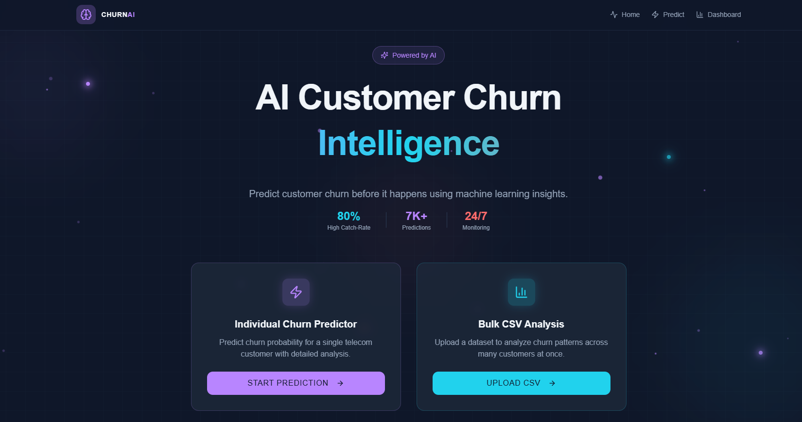
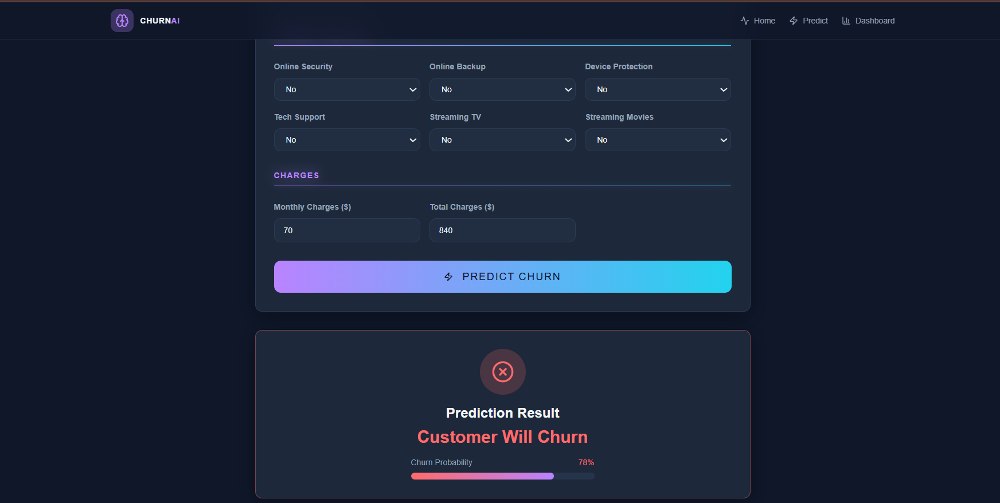
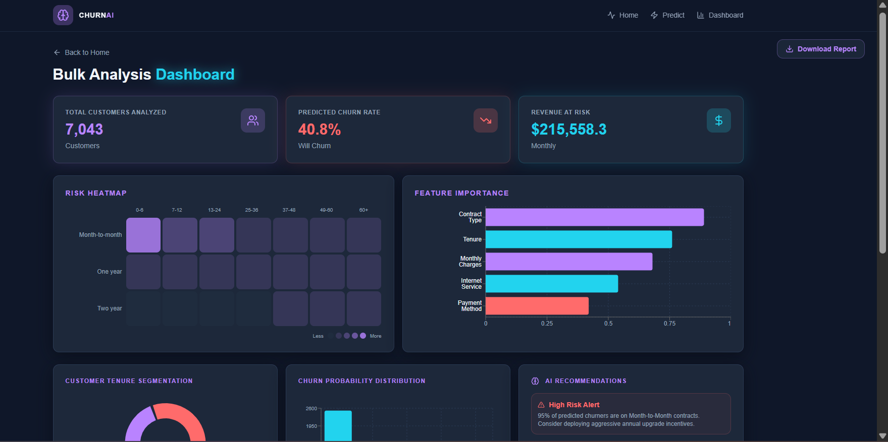
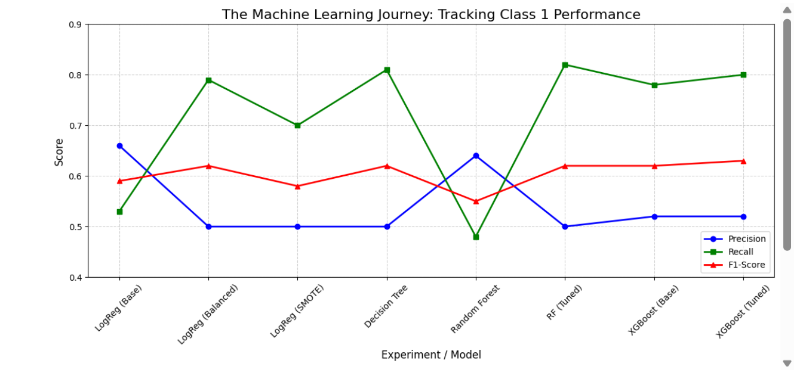

# Customer Churn Prediction App


A full-stack machine learning application that predicts customer churn using XGBoost and provides real-time predictions through an interactive dashboard.

## Project Overview

This project addresses the critical business challenge of customer retention by predicting whether a customer is likely to churn. By identifying at-risk customers, the application enables businesses to take proactive measures to reduce turnover and protect revenue. The app provides an end-to-end solution, from model training to an interactive user interface for real-time and batch predictions.

---

## 📸 Application Screenshots

### 🔹 Core Application Views

<table>
<tr>
<td align="center">

<br>
<b>Home Page</b>

</td>

<td align="center">

<br>
<b>Prediction Result</b>

</td>

<td align="center">

<br>
<b>Insights Dashboard</b>

</td>
</tr>
</table>

<br>

<table>
<tr>
<td align="center">

<br>
<b>Model Performance Comparison</b>

</td>
</tr>
</table>

---

## Features

* **Predict churn for a single customer**: Input individual customer data via a web form for instant results.
* **Batch prediction using CSV upload**: Upload entire datasets to process multiple predictions simultaneously.
* **Data preprocessing and feature encoding**: Automated handling of categorical and numerical data.
* **Trained machine learning model**: Integration of a high-performance, tuned classification model.
* **Visualization of prediction insights**: Graphical representations of churn probability and risk distributions.
* **Download prediction results**: Export batch prediction results as a downloadable CSV file.

## Tech Stack

* **Languages**: Python
* **ML Frameworks**: Scikit-learn, XGBoost
* **Data Manipulation**: Pandas, NumPy
* **Web Framework**: React (Frontend), FastAPI (Backend)
* **Visualization**: Matplotlib, Seaborn, Recharts

## Model Performance

The trained XGBoost model was evaluated using cross-validation and achieved strong predictive performance on the churn dataset.

Key evaluation metrics include:

| Metric | Score |
|------|------|
| Accuracy | 75% |
| Precision | 52% |
| Recall | 80% |
| F1 Score | 63% |

## Project Structure

```text
customer-churn-prediction/
│
├── backend/            # FastAPI/Python server and ML logic
│   ├── main.py
│   ├── ml_service.py
│   ├── schemas.py
│   └── requirements.txt
├── frontend/           # React/Vite dashboard code
│   ├── src/
│   ├── public/
│   └── package.json
├── model_artifacts/    # Saved .pkl models and scalers
│   ├── xgboost_churn_model.pkl
│   └── churn_scaler.pkl
├── notebooks/          # Jupyter notebooks for model training
│   └── churn_prediction.ipynb
├── reports/            # Project documentation and visuals
│   └── screenshots/
└── README.md

```

## How It Works

1. **Data Preprocessing**: Handles missing values and scales numerical features using `StandardScaler`.
2. **Feature Engineering**: Implements One-Hot Encoding for categorical variables and creates custom features like "Tenure Buckets".
3. **Model Training**: Evaluates multiple algorithms including Random Forest and XGBoost to find the optimal fit.
4. **Model Evaluation**: Uses K-Fold Cross-Validation and metrics like Recall to ensure robust performance.
5. **Prediction via UI**: Features are sent from the web interface to the backend for real-time inference.

## Installation and Setup

### Clone repository

```bash
git clone <repo-link>
cd customer-churn-prediction

```

### Install dependencies

```bash
# Backend setup
cd backend
pip install -r requirements.txt

# Frontend setup
cd ../frontend
npm install

```

### Run the application

```bash
# Start Backend
uvicorn main:app --reload

# Start Frontend (in a new terminal)
npm run dev

```

## Usage

* **Manual Inputs**: Navigate to the "Predict" page and fill in customer attributes (Contract, Monthly Charges, etc.) to get a churn probability score.
* **Upload CSV Files**: Go to the "Dashboard" and drag-and-drop your customer dataset to generate a full analytics report.
* **View Predictions**: Analyze the Risk Heatmap and high-risk customer tables to identify priority accounts.

## Model Information

The core engine utilizes **XGBoost (Extreme Gradient Boosting)**. This algorithm was selected for its superior performance in handling the imbalanced nature of churn datasets and its ability to capture complex, non-linear relationships between features.

## Future Improvements

* **Cloud Deployment**: Host the application on Render (Backend) and Vercel (Frontend).
* **Model Expansion**: Integrate more models for comparative analysis.
* **Advanced UI**: Enhance the dashboard with more granular filtering and real-time alerts.
* **Explainable AI**: Implement SHAP (SHapley Additive exPlanations) to explain individual prediction factors.

## Author

* **Name**: Shruti Bhale
* **Field**: Computer Science and Engineering Student at SATI, Vidisha
* **Interest**: Machine Learning and AI, specializing in predictive analytics and NLP

## License

Copyright (c) 2026 Shruti Bhale.

Licensed under the **MIT License**. See the LICENSE file for more details.

---